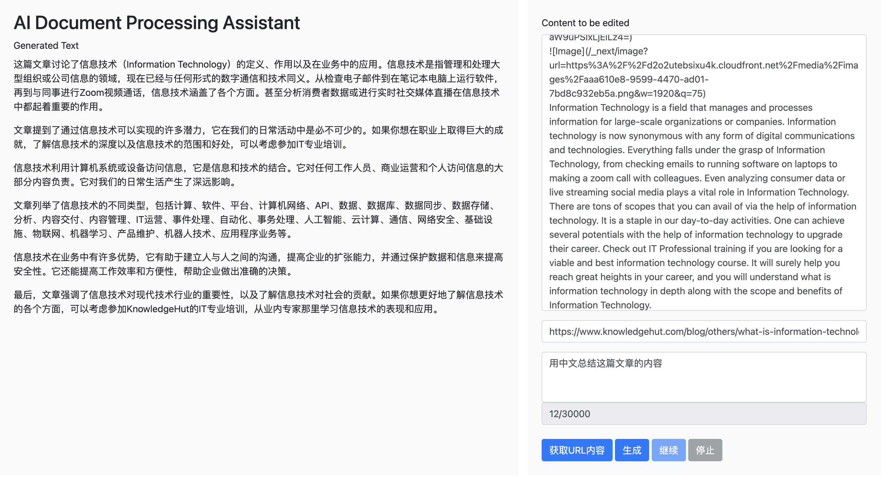
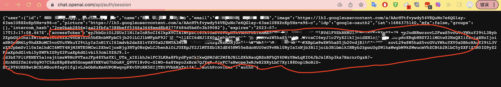

# AI_DocumentAssistant
A small tool that can automatically fetch the content of a URL page and submit it to chatgpt for processing.




本项目原本是想实现自动化采集处理文章的工具，就是自动填写好url。运行之后，会依次采集好网页内容，然后依次自动提交给chatGPT进行处理，处理完成之后，自动通过文章发布接口发布到网页中。
后来在实验的过程中发现，chatgpt在处理大量内容的时候，会经常性的生成不成功，这应该是官网一样的毛病。所以暂时放弃了。有能力开发的可以继续开发下去。目前作为小工具使用还是蛮不错的。


## 使用前提
1、电脑安装了go环境
2、URL抓取依靠chromedriver，需要提前自己安装好，chromedriver版本和chrome或者chromium的版本需要保持一致，网上教程很多，就不在这里讲了，自行安装好。

## 使用方法
```
git clone https://github.com/qutaojiao/AI_DocumentAssistant.git
cd AI_DocumentAssistant
go build
./main
```

运行之后，直接访问https://127.0.0.1:8888就可以打开页面了。

## 说明
### 修改stream-response.js文件的token和会话ID（可以改成前端刚打开的时候填写保存在localStorage中，就不用改代码了，暂时没做）
1、ChatGPT没有采用openai key的形式，而是直接使用的token，完全免费，不需要扣除额度的，需要有自己的openai账号，然后打开https://chat.openai.com/api/auth/session页面，copy自己的token，放到assets/js/stream-response.js文件的const OPENAI_TOKEN常量后面。圈起来的那串：


2、刚打开生成内容的时候，会自动创建一个会话，并且将会话ID保存在浏览器localStorage中，可以加个按钮创建新会话，暂时没做。


